# Spam Message Detection System

A machine learning-based Spam Message Detection System developed using Python and Tkinter. The system detects spam and legitimate (ham) messages and provides multiple security, analysis, and AI-assisted features through an interactive graphical user interface.

## 🚀 Features

- 📩 Spam and Ham message detection
- 🤖 AI Chatbot integration
- 🔐 Phishing detection
- 🌐 URL checking
- 🖼️ Image-based text detection using OCR
- 🇮🇳 Hindi message detection
- 💬 Hinglish message detection
- 🌐 English language detection
- 📊 Dashboard with detection statistics
- 📈 Graph and visualization
- 📜 Message history
- 🔊 Voice output
- 🌙 Dark mode
- 🕐 Live digital clock
- ⚙️ Settings
- 📋 Copy and export functionality

## 🛠️ Technologies Used

- Python
- Tkinter
- Pandas
- Scikit-learn
- Matplotlib
- OpenAI API
- OCR
- CSV Dataset
- Python-dotenv
- Pyttsx3

## 🤖 Machine Learning

The project uses machine learning techniques for spam message classification.

### English Spam Detection

The English spam detection system uses:

- CountVectorizer
- Multinomial Naive Bayes
- Train/Test Split
- Accuracy
- Precision
- Recall
- F1-Score
- Confusion Matrix

### Hindi and Hinglish Detection

The system also includes separate support for Hindi and Hinglish messages using a dedicated dataset and machine learning model.

## 🔐 Security Features

The system provides additional security analysis including:

- Phishing detection
- Suspicious link detection
- URL analysis
- VirusTotal-based URL checking
- Image text analysis
- Security analysis through AI chatbot

## 🖼️ Image Detection

The application can analyze text present in images using OCR.

This feature can be used to extract and analyze text from screenshots or other images for spam and security analysis.

## 🌐 URL and Phishing Detection

The system analyzes URLs and checks for potentially suspicious or phishing-related links.

It can also use VirusTotal-based URL checking for additional security analysis.

## 🤖 AI Chatbot

The application includes an integrated AI chatbot that can provide additional analysis of messages and security-related information.

The chatbot can use the application's analysis results, including:

- Spam/Ham classification
- Language detection
- Phishing detection
- URL analysis
- Security information

> API keys should be stored securely in a .env file and should never be uploaded to GitHub.

## 📊 Dashboard

The dashboard provides information such as:

- Spam count
- Ham count
- Precision
- Recall
- F1-Score
- Confusion Matrix
- Graphical analysis

## 📜 Message History

The application maintains message analysis history so previously analyzed messages and their results can be reviewed.

## 🎨 User Interface

The application provides a Tkinter-based graphical user interface with:

- Main dashboard
- Dark mode
- Settings
- Live digital clock
- Voice output
- Analysis pages
- History
- Graphs
- AI chatbot

## 📁 Project Structure

```text
Spam Message Detection System/
│
├── main.py
├── ai_chatbot.py
├── config.py
├── dashboard.py
├── dataset.py
├── graph.py
├── hindi_model.py
├── history.py
├── image_detector.py
├── language_detector.py
├── model.py
├── phishing.py
├── url_checker.py
│
├── hindi_spam.csv
├── SMSSpamCollection
│
├── Spam Detector.spec
│
└── README.md
''''

▶️ How to Run
1. Install Python
Install Python 3.x on your system.

2. Install Required Libraries
pip install pandas scikit-learn matplotlib python-dotenv openai pyttsx3

3. Configure API Key
Create a .env file in the project directory and add your API key.
OPENAI_API_KEY=xxxxxxxxxxxxxxxxx
Do not upload the .env file to GitHub.

4. Run the Application
python main.py
''''

## 📸 Screenshots

### Main Interface
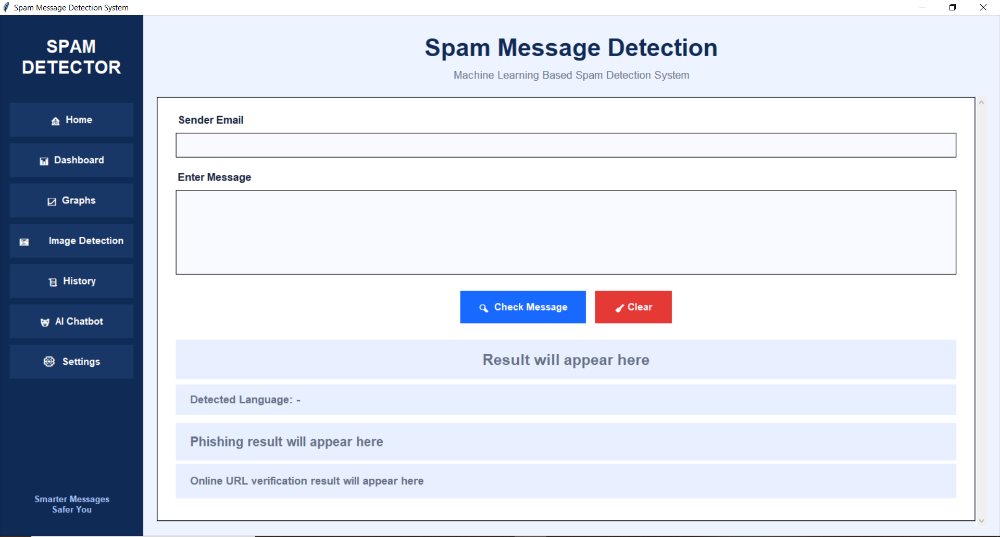

### Spam Detection
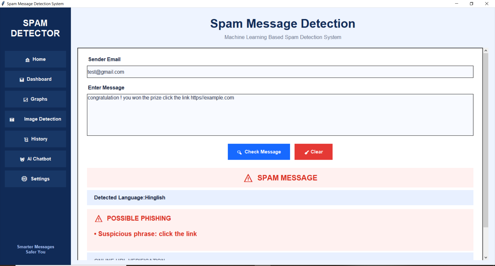

### Dashboard
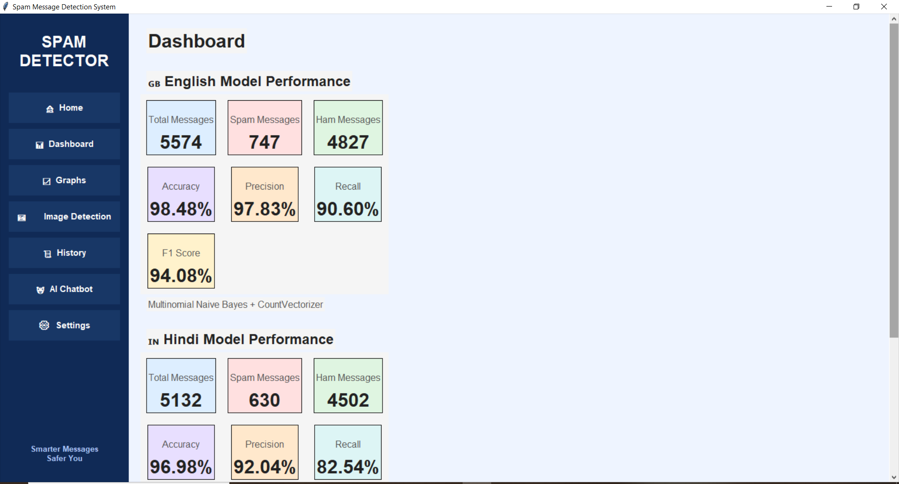

### Graph Visualization
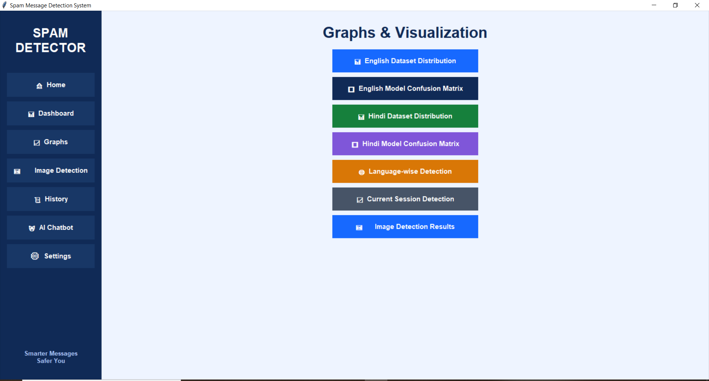

### Message History
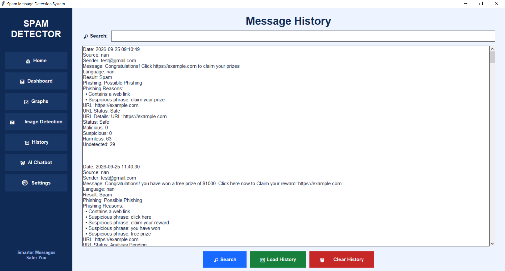

### Settings
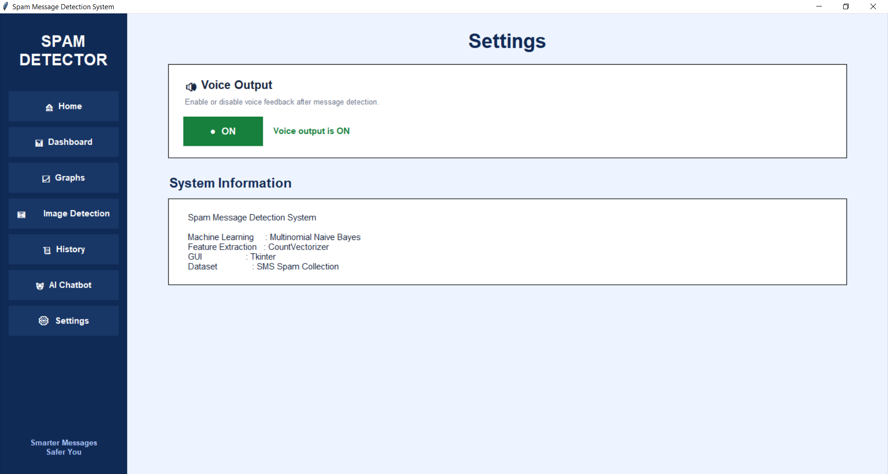

### Language Detection
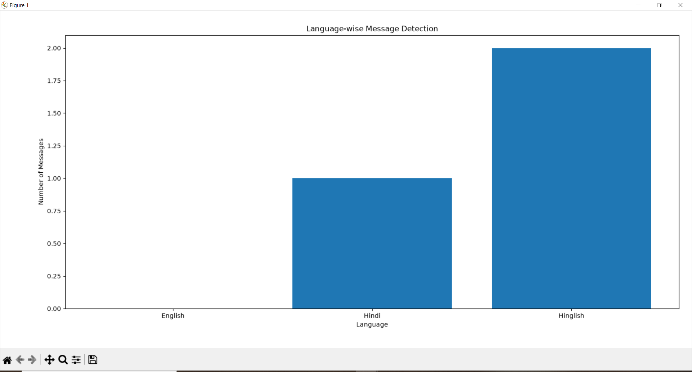

### Hindi Detection
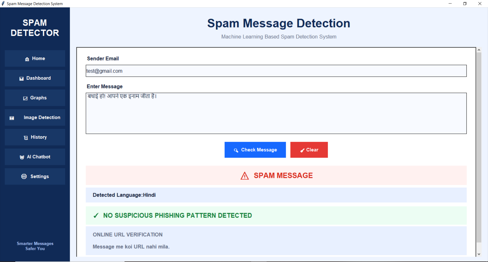

### Hindi Confidence
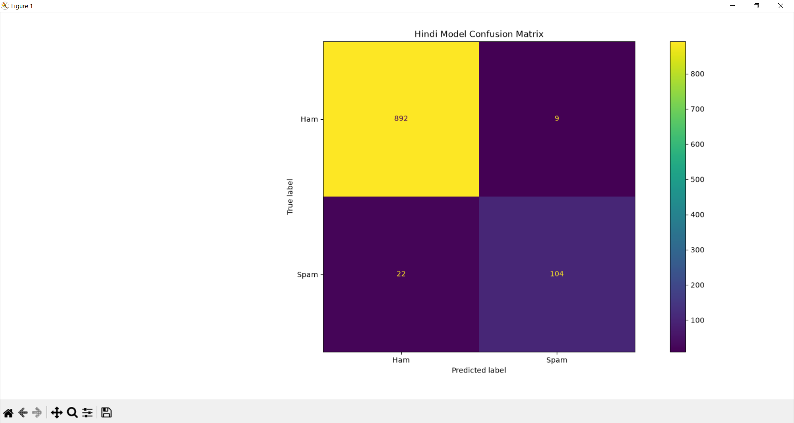

### Hindi Data Analysis


### Hinglish Detection
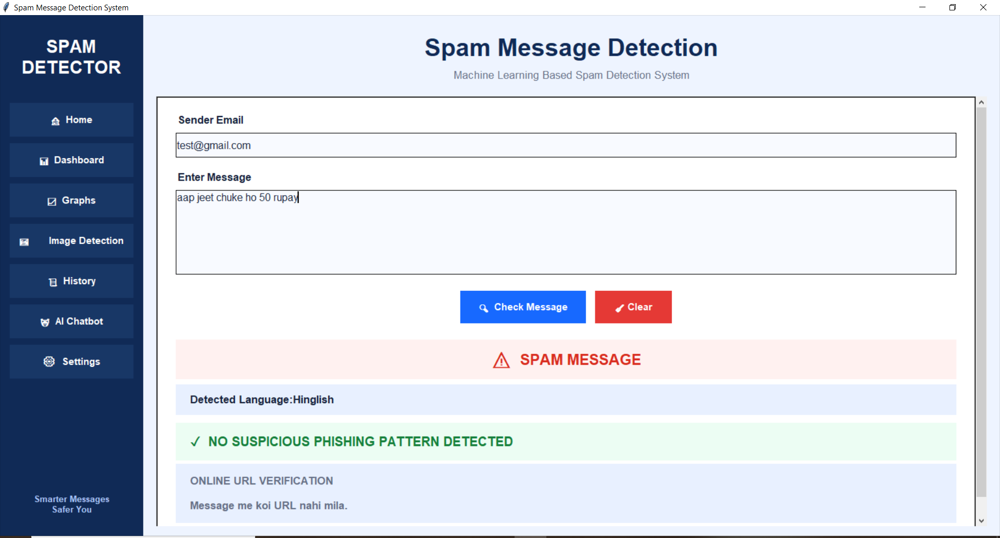

### English Confidence
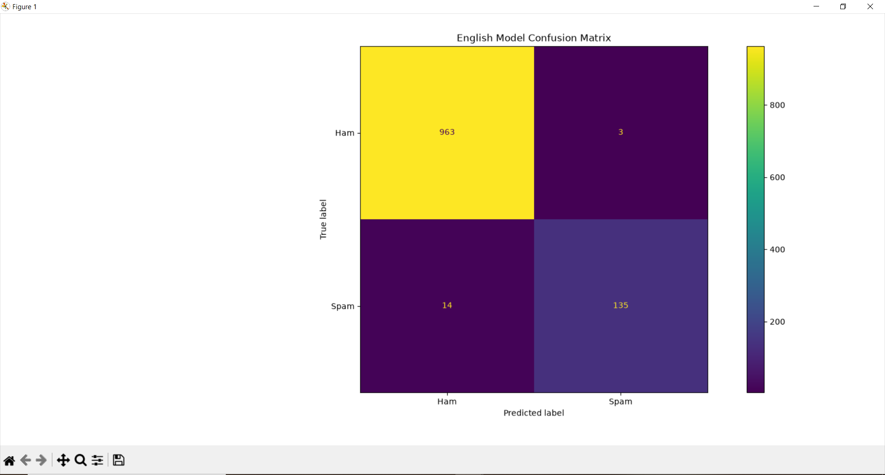

### English Data Analysis
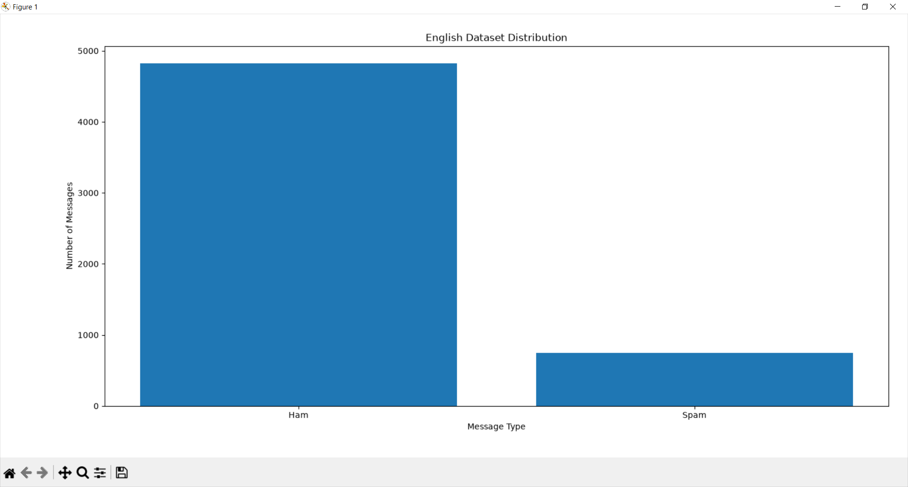

### AI Chatbot
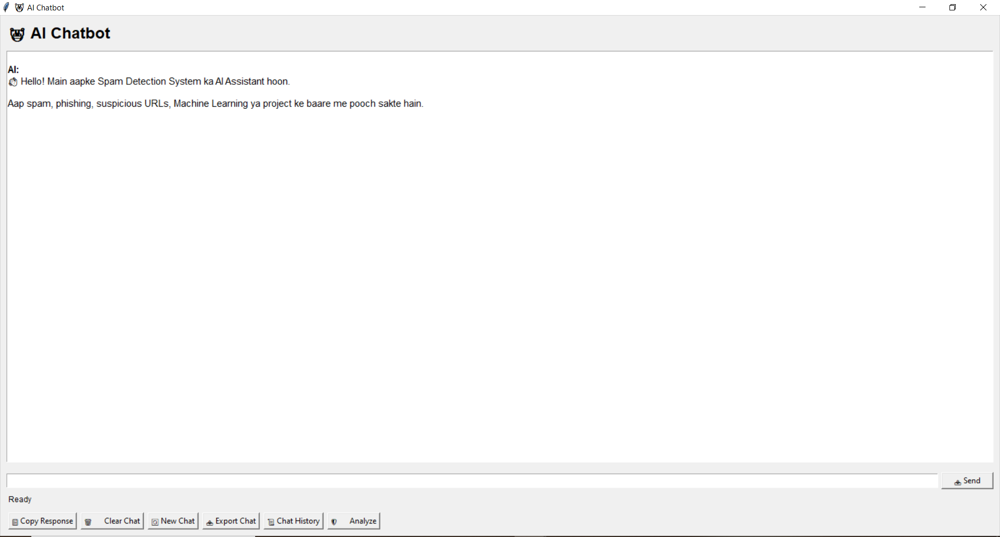

### Image Detection
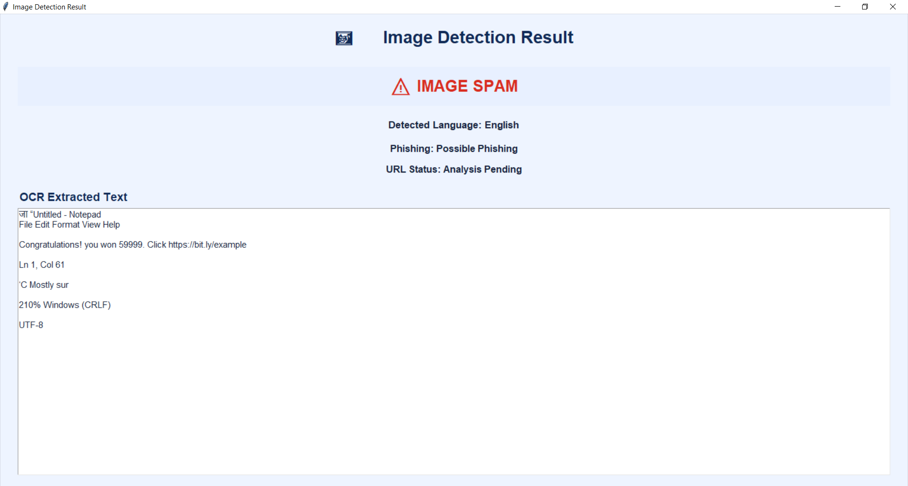

🎯 Project Objective
The main objective of this project is to develop a user-friendly spam message detection system that combines machine learning with additional security and analysis features such as phishing detection, URL analysis, image text detection, multilingual support, and AI-assisted analysis.

🔒 Security Note
Never upload API keys, passwords, private chat history, or other sensitive information to a public GitHub repository.
The .env file containing API credentials should remain private.

👨‍💻 Author
Anurag Sharma
Computer Science & Engineering
Barkatullah University, Bhopal

📄 License
This project is developed for educational and project purposes.


